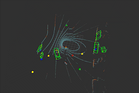
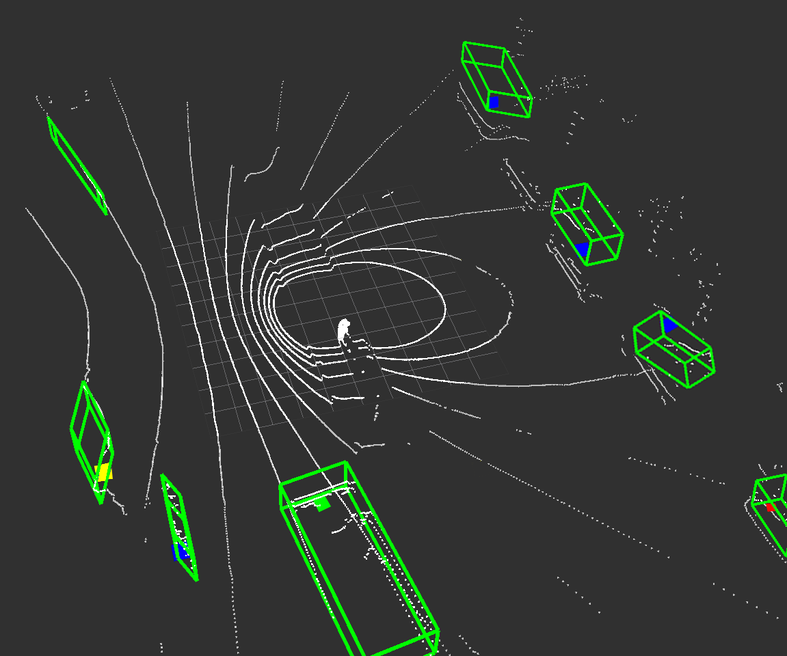

# ROS Package for Multi Object Detecton/Tracking and Classification (Static/Dynamic)
PCL based ROS package to Detect/Cluster --> Track --> Classify static and dynamic objects in real-time from LIDAR scans implemented in C++.
This package includes Ground Removal, Object Clustering, Bounding Box, Uscented Kalman Filter, Multi Motion Models interaction, Probabilistic Data Association, Track Management and Object Classification (Static/Dynamic)



### Setup
##### Frameworks and Packages
Make sure you have the following is installed:

* ROS Noetic
* PCL 1.10
* Open CV 4.2

### Content
```shell

├── src
     ├── Detector
     │      ├── ground_rmv
     │      │     └── gaussian_blur.cpp  
     │      │     └── ground_removal.cpp
     │      │     └── main.cpp
     │      └──  cluster
     │              ├── box_fitting.cpp      
     │              ├── clustering.cpp
     │              └── main.cpp 
     └── Tracker
           ├── Eigen
           ├── ...
           ├── ukf.cpp       
           ├── imm_ukf_jpda.cpp
           └── main.cpp  
```
### Start

##### Terminal 1
```
roscore
```

##### Terminal 2
```
rosbag play 2023-03-22-23-23-53.bag --loop

```

##### Terminal 4

```
cd ~/catkin_ws && catkin_make
source ~/catkin_ws/devel/setup.bash
rosrun detection_classification remove_ground
```
##### Terminal 4

```
cd ~/catkin_ws && catkin_make
source ~/catkin_ws/devel/setup.bash
rosrun detection_classification cluster
```
##### Terminal 4

```
cd ~/catkin_ws && catkin_make
source ~/catkin_ws/devel/setup.bash
rosrun detection_classification tracker
```
### Result



